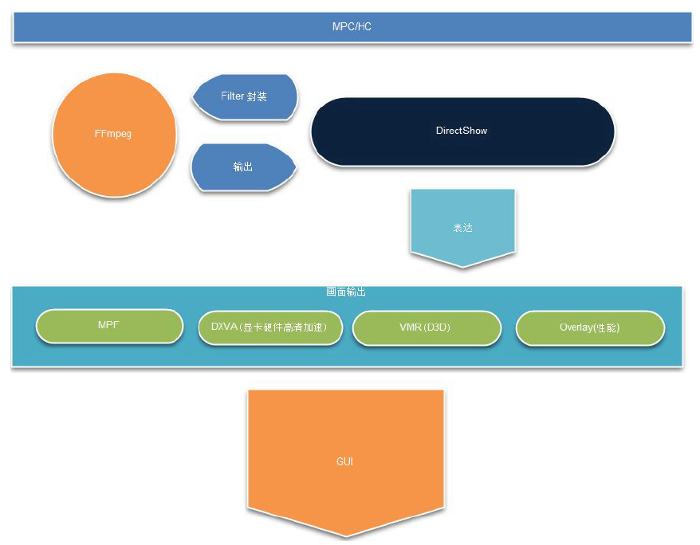
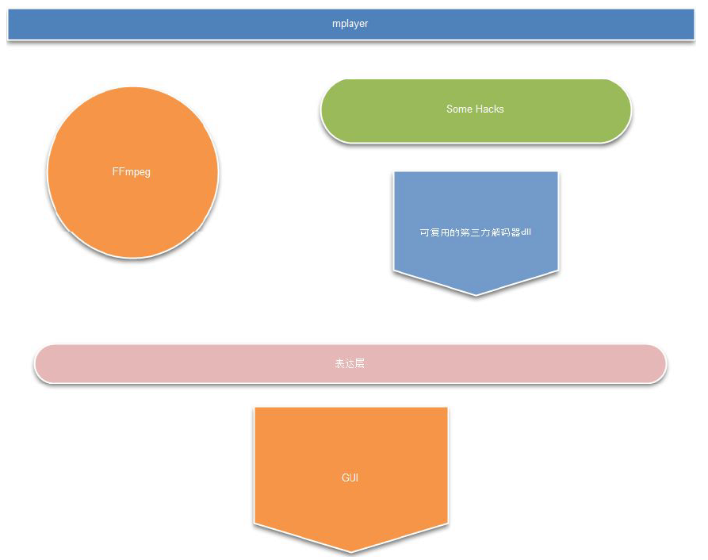
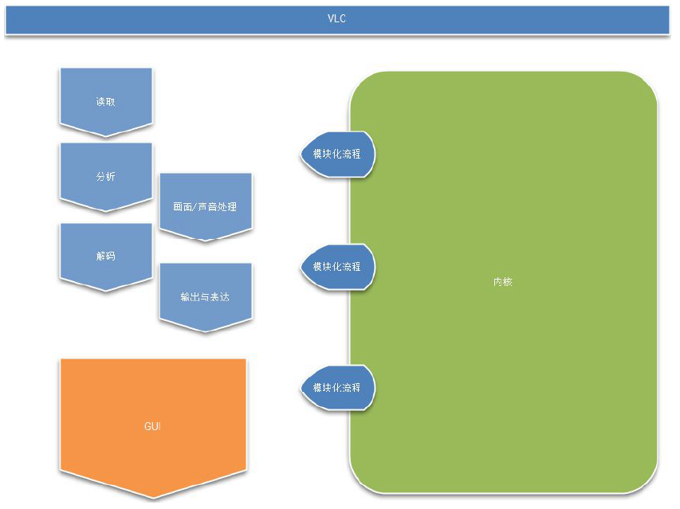

# 音视频播放器原理

视音频技术主要包含以下几点：封装技术，视频压缩编码技术以及音频压缩编码技术。如果考虑到网络传输的话，还包括流媒体协议技术。

## 视频播放内部处理过程

视频播放器播放一个互联网上的视频文件，需要经过以下几个步骤：解协议，解封装，解码视音频，视音频同步。如果播放本地文件则不需要解协议，只经过以下步骤：解封装，解码视音频，视音频同步。

**解协议**的作用，就是将流媒体协议的数据，解析为标准的相应的封装格式数据。视音频在网络上传播的时候，常常采用各种流媒体协议，例如 HTTP，RTMP，或是 MMS 等等。这些协议在传输视音频数据的同时，也会传输一些信令数据。这些信令数据包括对播放的控制（播放，暂停，停止），或者对网络状态的描述等。解协议的过程中会去除掉信令数据而只保留视音频数据。例如，采用 RTMP 协议传输的数据，经过解协议操作后，输出 FLV 格式的数据。

**解封装**的作用，就是将输入的封装格式的数据，分离成为音频流压缩编码数据和视频流压缩编码数据。封装格式种类很多，例如 MP4，MKV，RMVB，TS，FLV，AVI 等等，它的作用就是将已经压缩编码的视频数据和音频数据按照一定的格式放到一起。例如，FLV 格式的数据，经过解封装操作后，输出 H.264 编码的视频码流和 AAC 编码的音频码流。

**解码**的作用，就是将视频/音频压缩编码数据，解码成为非压缩的视频/音频原始数据。音频的压缩编码标准包含 AAC，MP3，AC-3 等等，视频的压缩编码标准则包含 H.264，MPEG2，VC-1 等等。解码是整个系统中最重要也是最复杂的一个环节。通过解码，压缩编码的视频数据输出成为非压缩的颜色数据，例如 YUV420P，RGB 等等；压缩编码的音频数据输出成为非压缩的音频抽样数据，例如 PCM 数据。

**视音频同步**的作用，就是根据解封装模块处理过程中获取到的参数信息，同步解码出来的视频和音频数据，并将视频音频数据送至系统的显卡和声卡播放出来。

## 播放器三大底层框架

业界有 3 大架构：MPC、MPlayer 和 VLC。

### MPC/HC 架构

MPC 基于 DirectShow 架构，是 Windows 系统下的播放器。MPCHC 则是在MPC 的原作者渐渐退出开发后的继承者，MPCHC 有很多创新特性，包括开始融入 FFmpeg 和支持更多 DirectX 特性和 DXVA 等等。

### MPlayer 架构

MPlayer 是 Linux 上的播放器。MPlayer 以 FFmpeg 为解码核心，MPlayer 建立了比 DirectShow 稳定的工作流程。

### VLC 架构

VLC 是后起之秀，VLC 的架构在设计之初就很好的考虑到模块化开发。

