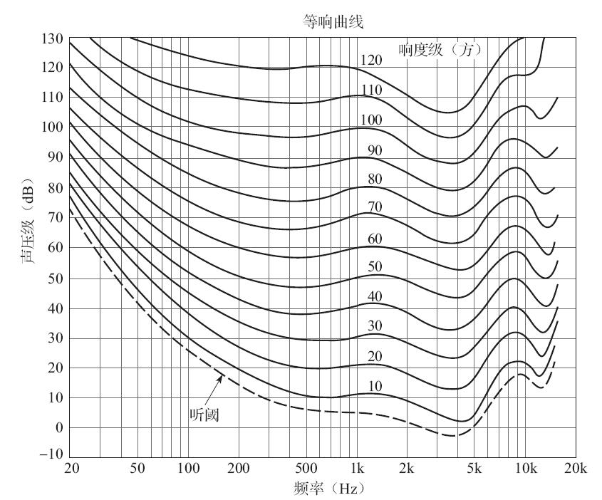

# 音视频基础概念

- [音视频基础概念](#音视频基础概念)
  - [声波的三要素](#声波的三要素)
  - [数字音频](#数字音频)
  - [音频编码](#音频编码)
  - [图像的数值表示](#图像的数值表示)
    - [RGB 表示方式](#rgb-表示方式)
    - [YUV 表示方式](#yuv-表示方式)
    - [YUV 和 RGB 的转化](#yuv-和-rgb-的转化)

## 声波的三要素

声波的三要素是频率、振幅和波形，频率代表音阶的高低，振幅代表响度，波形代表音色。

频率（过零率）越高，波长就越短。低频声响的波长则较长，所以其可以更容易地绕过障碍物，因此能量衰减就小，声音就会传得远，反之则会得到完全相反的结论。

响度其实就是能量大小的反映，用不同的力度敲击桌子，声音的大小势必也会不同。在生活中，分贝常用于描述响度的大小。声音超过一定的分贝，人类的耳朵就会受不了。

音色其实也不难理解，在同样的音调（频率）和响度（振幅）下，钢琴和小提琴的声音听起来是完全不相同的，因为它们的音色不同。波的形状决定了其所代表声音的音色，钢琴和小提琴的音色不同就是因为它们的介质所产生的波形不同。

人类耳朵的听力有一个频率范围，大约是20Hz～20kHz，不过，即使是在这个频率范围内，不同的频率，听力的感觉也会不一样，业界非常著名的等响曲线，就是用来描述等响条件下声压级与声波频率关系的，如图所示。

人耳对3～4kHz频率范围内的声音比较敏感，而对于较低或较高频率的声音，敏感度就会有所减弱；在声压级较低时，听觉的频率特性会很不均匀；而在声压级较高时，听觉的频率特性会变得较为均匀。频率范围较宽的音乐，其声压以80～90dB为最佳，超过90dB将会损害人耳（105dB为人耳极限）。

## 数字音频

为了将模拟信号数字化，必须对信号依次进行采样、量化和编码。

**采样**是在时间轴上对信号进行数字化。根据奈奎斯特定理（也称为采样定理），按比声音最高频率高2倍以上的频率对声音进行采样（也称为AD转换），对于高质量的音频信号，其频率范围（人耳能够听到的频率范围）是20Hz～20kHz，所以采样频率一般为44.1kHz，这样就可以保证采样声音达到20kHz也能被数字化，从而使得经过数字化处理之后，人耳听到的声音质量不会被降低。而所谓的44.1kHz就是代表1秒会采样44100次。

**量化**是指在幅度轴上对信号进行数字化，比如用16比特的二进制信号来表示声音的一个采样，而16比特（一个short）所表示的范围是［-32768，32767］，共有65536个可能取值，因此最终模拟的音频信号在幅度上也分为了65536层。

**编码**是按照一定的格式记录采样和量化后的数字数据，比如顺序存储或压缩存储，等等。

这里面涉及了很多种格式，通常所说的音频的裸数据格式就是**脉冲编码调制**（Pulse Code Modulation，PCM）数据。描述一段 PCM 数据一般需要以下几个概念：**量化格式**（sampleFormat）、**采样率**（sampleRate）、**声道数**（channel）。以 CD 的音质为例：量化格式（有的地方描述为位深度）为 16 比特（2 字节），采样率为 44100，声道数为 2，这些信息就描述了 CD 的音质。而对于声音格式，还有一个概念用来描述它的大小，称为数据比特率，即 1 秒时间内的比特数目，它用于衡量音频数据单位时间内的容量大小。而对于CD音质的数据，比特率为多少呢？计算如下：

44100 * 16 * 2 = 1378.125 kbps

那么在 1 分钟里，这类 CD 音质的数据需要占据多大的存储空间呢？计算如下：

1378.125 * 60 / 8 / 1024 = 10.09 MB

存储的这段二进制数据即表示将模拟信号转换为数字信号了，以后就可以对这段二进制数据进行存储、播放、复制，或者进行其他任何操作。

**分贝**是用来表示声音强度的单位。日常生活中听到的声音，若以声压值来表示，由于其变化范围非常大，可以达到六个数量级以上，同时由于我们的耳朵对声音信号强弱刺激的反应不是线性的，而是呈对数比例关系，所以引入分贝的概念来表达声学量值。所谓分贝是指两个相同的物理量之比取以 10 为底的对数并乘以10，即：

N= 10 * lg（A1 / A0）

分贝符号为 `dB`，它是无量纲的。式中 A0 是基准量（或参考量），A1 是被量度量。

## 音频编码

压缩编码的基本指标之一就是压缩比，压缩比通常小于1（否则就没有必要去做压缩，因为压缩就是要减小数据容量）。压缩算法包括有损压缩和无损压缩。无损压缩是指解压后的数据可以完全复原。在常用的压缩格式中，用得较多的是有损压缩，有损压缩是指解压后的数据不能完全复原，会丢失一部分信息，压缩比越小，丢失的信息就越多，信号还原后的失真就会越大。根据不同的应用场景（包括存储设备、传输网络环境、播放设备等），可以选用不同的压缩编码算法，如 PCM、WAV、AAC、MP3、Ogg 等。

压缩编码的原理实际上是压缩掉冗余信号，冗余信号是指不能被人耳感知到的信号，包含人耳听觉范围之外的音频信号以及被掩蔽掉的音频信号等。而被掩蔽掉的音频信号则主要是因为人耳的掩蔽效应，主要表现为频域掩蔽效应与时域掩蔽效应，无论是在时域还是频域上，被掩蔽掉的声音信号都被认为是冗余信息，不进行编码处理。

## 图像的数值表示

### RGB 表示方式

任何一个图像都可以由 RGB 组成，那么一个像素点的 RGB 该如何表示呢？音频里面的每一个采样均使用 16 个比特来表示，那么像素里面的子像素又该如何表示呢？常用的表示方式有以下几种。

- 浮点表示：取值范围为 0.0～1.0，比如，在 OpenGL ES 中对每一个子像素点的表示使用的就是这种表达方式。
- 整数表示：取值范围为 0～255 或者 00～FF，8 个比特表示一个子像素，**32 个比特表示一个像素**，这就是类似于某些平台上表示图像格式的 RGBA_8888 数据格式。比如，Android平 台上 RGB_565 的表示方法为 16 比特模式表示一个像素，R 用 5 个比特来表示，G 用 6 个比特来表示，B 用 5 个比特来表示。

对于一幅图像，一般使用整数表示方法来进行描述，比如计算一张 1280×720 的 RGBA_8888 图像的大小，可采用如下方式：

1280 * 720 * 4 = 3.516 MB

这也是位图（bitmap）在内存中所占用的大小，所以每一张图像的裸数据都是很大的。对于图像的裸数据来讲，直接在网络上进行传输也是不太可能的，所以就有了图像的压缩格式，比如JPEG压缩：JPEG是静态图像压缩标准，由ISO制定。JPEG图像压缩算法在提供良好的压缩性能的同时，具有较好的重建质量。这种算法被广泛应用于图像处理领域，当然其也是一种有损压缩。

但是，这种压缩不能直接应用于视频压缩，因为对于视频来讲，还有一个时域上的因素需要考虑，也就是说，不仅仅要考虑帧内编码，还要考虑帧间编码。

### YUV 表示方式

对于视频帧的裸数据表示，更多的是 YUV 数据格式的表示，YUV 主要应用于优化彩色视频信号的传输，使其向后兼容老式黑白电视。与 RGB 视频信号传输相比，它最大的优点在于只需要占用极少的频宽（RGB 要求三个独立的视频信号同时传输）。其中 “Y” 表示明亮度（Luminance 或 Luma），也称灰阶值；而 “U” 和 “V” 表示的则是色度（Chrominance或Chroma），它们的作用是描述影像的色彩及饱和度，用于指定像素的颜色。“亮度”是透过 RGB 输入信号来建立的，方法是将 RGB 信号的特定部分叠加到一起。“色度”则定义了颜色的两个方面——色调与饱和度，分别用 Cr 和 Cb 来表示。其中，Cr 反映了 RGB 输入信号红色部分与 RGB 信号亮度值之间的差异，而 Cb 反映的则是 RGB 输入信号蓝色部分与 RGB 信号亮度值之间的差异。

之所以采用 YUV 色彩空间，是因为它的亮度信号 Y 和色度信号 U、V 是分离的。如果只有 Y 信号分量而没有 U、V 分量，那么这样表示的图像就是黑白灰度图像。彩色电视采用 YUV 空间正是为了用亮度信号 Y 解决彩色电视机与黑白电视机的兼容问题，使黑白电视机也能接收彩色电视信号，最常用的表示形式是 Y、U、V 都使用8个字节来表示，所以取值范围就是 0～255。在广播电视系统中不传输很低和很高的数值，实际上是为了防止信号变动造成过载，因而把这“两边”的数值作为“保护带”，不论是 Rec.601 还是 BT.709 的广播电视标准中，Y 的取值范围都是 16～235，UV 的取值范围都是 16～240。

YUV 最常用的采样格式是 4:2:0，4:2:0 并不意味着只有 Y、Cb 而没有 Cr 分量。它指的是对每行扫描线来说，只有一种色度分量是以 2:1 的抽样率来存储的。相邻的扫描行存储着不同的色度分量，也就是说，如果某一行是 4:2:0，那么其下一行就是 4:0:2，再下一行是 4:2:0，以此类推。对于每个色度分量来说，水平方向和竖直方向的抽样率都是 2:1，所以可以说色度的抽样率是 4:1。对非压缩的 8 比特量化的视频来说，8×4 的一张图片需要占用 48 字节的内存

相较于 RGB，我们可以计算一帧为 1280×720 的视频帧，用 YUV420P 的格式来表示，其数据量的大小如下：

1280 * 720 * 1 ＋ 1280 * 720 * 0.5 = 1.318MB

如果 fps（1秒的视频帧数目）是 24，按照一般电影的长度 90 分钟来计算，那么这部电影用 YUV420P 的数据格式来表示的话，其数据量的大小就是：

1.318MB * 24fps * 90min * 60s = 166.8GB

### YUV 和 RGB 的转化

凡是渲染到屏幕上的东西（文字、图片或者其他），都要转换为 RGB 的表示形式，不同设备的转换标准各有不同，必须寻找对应的文档，以找出适合的转换矩阵进行转换。
