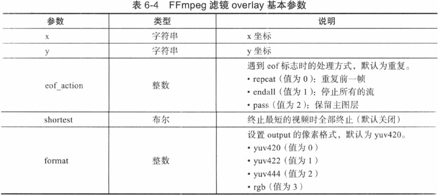

# Overlay Fliter 详解

> 视频/图像的叠加

- [Overlay Fliter 详解](#overlay-fliter-详解)
  - [基本参数](#基本参数)
  - [实现画中画](#实现画中画)
  - [实现横幅滚动](#实现横幅滚动)
  - [视频多宫格](#视频多宫格)

## 基本参数



## 实现画中画

```
ffmpeg -i video.mp4 -vf "movie=video.mp4,scale=480x320[logo];[in][logo]overlay[out]" video_in_video.mp4
```

将画中画放置于右下角：

```
ffmpeg -i video.mp4 -vf "movie=video.mp4,scale=480x320[logo];[in][logo]overlay=x=main_w-480:y=main_h-320[out]" video_in_video2.mp4
```

- `main_w` 主视频宽度
- `main_h` 主视频高度

## 实现横幅滚动

```
ffmpeg -i video.mp4 -vf "movie=video.mp4,scale=480x320[logo];[in][logo]overlay=x='if(gte(t,1),-w+t*400,NAN)':y=0 [out]" -vcodec libx264 video_in_video3.mp4
```

- `t` 时间，秒
- `[in]` 指输入视频
- `[out]` 指输出视频
- `gte(t,1)` 如果 `t>=1`，返回 1，否则返回 0
- `if(gte(t,1),-w+t*400,NAN)` 如果 `gte(t,1)` 非 0，返回 `-w+t*400`，否则返回 `NAN`，非数，即不显示滚动视频，表示从主视频播放 1s 后开始显示滚动，滚动视频左上角 x 坐标为 `-w+t*400`，w 是滚动视频宽度
- `-vcodec` 指定编解码器

## 视频多宫格

```
ffmpeg -i video.mp4 -i video.mp4 -i video.mp4 -i video.mp4 -filter_complex "nullsrc=size=640x480[base];[0:v]scale=320x240[topleft];[1:v]scale=320x240[topright];[2:v]scale=320x240[bottomleft];[3:v]scale=320x240[bottomright];[base][topleft]overlay=shortest=1[tmp1];[tmp1][topright]overlay=shortest=1:x=320[tmp2];[tmp2][bottomleft]overlay=shortest=1:y=240[tmp3];[tmp3][bottomright]overlay=shortest=1:x=320:y=240" -vcodec libx264 video_9grids.flv
```

- `nullsrc` 创建画布
- `shortest` 最短的那条流决定了编码时长，默认情况下，编解码处理是处理完所有媒体流才会结束的，也就是最长的那条流决定处理的时长

```shell

```

```shell

```

```shell

```

```shell

```
