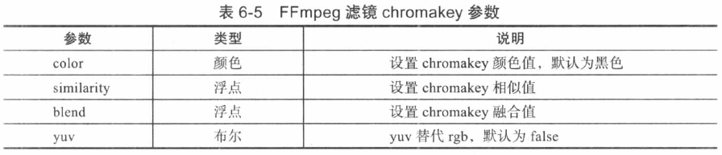

# 视频 Filter 详解

- [视频 Filter 详解](#视频-filter-详解)
  - [常用 Filter 及其用途](#常用-filter-及其用途)
  - [扣图合并](#扣图合并)
  - [视频截图](#视频截图)
  - [定时截图](#定时截图)
  - [截取关键帧图片](#截取关键帧图片)
  - [视频倍速处理](#视频倍速处理)
  - [视觉处理](#视觉处理)
    - [增加亮度](#增加亮度)
    - [增加对比度](#增加对比度)

- [添加字幕](subtitle.md) 
- [添加水印](watermark.md)
- [Overlay Fliter 详解](overlay.md) - 视频/图像的叠加
- [淡入淡出与交叉淡入淡出](fade.md)

## 常用 Filter 及其用途

- `scale`：视频/图像的缩放
- `crop`：视频/图像的裁剪
- `trim`：截取视频的片段
- `rotate`：以任意角度旋转视频

## 扣图合并



将绿色背景中的人物抠出来贴到另一个视频中：

```shell
ffmpeg -i input.mp4 -i input_green.mp4 -filter_complex "[1:v]chromakey=Green:0.1:0.2[ckout];[0:v][ckout]overlay[out]" -map [out] output.mp4
```

## 视频截图

```
ffmpeg -i video.mp4 -ss 00:00:04 -vframes 1 video.png
```

- `-ss` 定位时间
- `-vframes `限制输出的视频帧数

## 定时截图

```
ffmpeg -y -i video.mp4 -vf fps=1/2 video%d.png
```

- `fps` 帧率
- `fps=1/2` 每 2s 截图 1 张
- `fps=1` 每 1s 截图 1 张
- `fps=2` 每 1s 截图 2 张

## 截取关键帧图片

```
ffmpeg -y -i video.mp4 -vf "select='eq(pict_type,PICT_TYPE_I)'" -vsync vfr thumb%d.png
```

## 视频倍速处理

```
ffmpeg -y -i video.mp4 -filter_complex "setpts=PTS*2" video_slow.mp4
```

输出的视频文件的时长是原来的 2 倍，播放速度就是是原来的 1/2

- `setpts` 更改输入帧的 PTS（显示时间戳）
- `PTS*2` 原来帧在 PTS 时显示，`*2` 让帧延迟到 `PTS*2` 时显示

## 视觉处理

### 增加亮度

```
-vf eq=brightness=0.25
```

取值范围是从 -1.0 到 1.0，默认值是 0。

### 增加对比度

```
-vf eq=contrast=1.5
```

取值范围是从 -2.0 到 2.0，默认值是 1.0。
