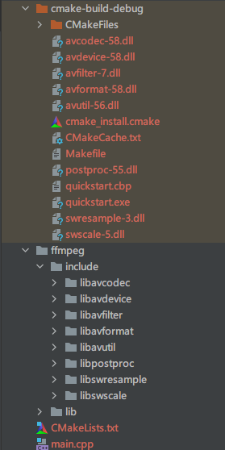

# Windows

- [Windows](#windows)
  - [用 CLion 新建工程](#用-clion-新建工程)
  - [CMakeLists 文件的编写](#cmakelists-文件的编写)
    - [C](#c)
    - [C++](#c-1)
  - [测试是否成功](#测试是否成功)
    - [C](#c-2)
    - [C++](#c-3)

进官网下载 `dev` 和 `shared` 压缩包

```
https://ffmpeg.zeranoe.com/builds/

https://www.gyan.dev/ffmpeg/builds/packages/ffmpeg-2020-09-24-git-14d6838638-full_build.zip
```

- Static 里只有 3 个程序：ffmpeg.exe，ffplay.exe，ffprobe.exe，每个的体积都很大，因为相关的 dll 文件已经被编译到文件里面去了；
- Shared 里除了 3 个程序之外，还有一些 dll，程序体积很小，因为运行时会动态链接其中的 dll 文件；
- Dev 版本是用于开发的，里面只包含了库文件 xxx.lib 以及头文件 xxx.h。

## 用 CLion 新建工程

创建一个新的工程，然后在根目录新建以下文件夹：

```shell
ffmpeg/include          # 存放引用的头文件
ffmpeg/lib              # 存放所依赖的库文件
src                     # 存放代码
video                   # 存放测试视频
```

解压，把 `shared` 压缩包里 `bin` 中的 `.dll` 文件放入工程目录的 `cmake-build-debug` 中；然后把 `dev` 压缩包里的 `include` 和 `lib` 文件夹复制到工程目录的 `ffmpeg` 文件夹中。

**目录结构如下**




## CMakeLists 文件的编写

### C

```makefile
cmake_minimum_required(VERSION 3.14)
project(quickstart C)

set(CMAKE_C_STANDARD 99)

# ./ 不可少
include_directories(./ffmpeg/include) # 头文件路径
link_directories(./ffmpeg/lib) # 链接库路径

# 链接库
link_libraries(
        avcodec
        avformat
        avutil
        avdevice
        avfilter
        postproc
        swresample
        swscale
)

add_executable(quickstart main.c)
```

### C++

```makefile
cmake_minimum_required(VERSION 3.14)
project(quickstart)

set(CMAKE_CXX_STANDARD 14)

include_directories(ffmpeg/include) # 头文件路径
link_directories(ffmpeg/lib) # 链接库路径

# 链接库
link_libraries(
        avcodec
        avformat
        avutil
        avdevice
        avfilter
        postproc
        swresample
        swscale
)

add_executable(quickstart main.cpp)
```

## 测试是否成功

### C

```c
#include <stdio.h>
#include "libavcodec/avcodec.h"

int main() {
    printf("%s\n", avcodec_configuration());
    printf("Hello, World!\n");
    return 0;
}
```

### C++

```c++
#include <iostream>

extern "C" {
#include "libavcodec/avcodec.h"
}

int main(int argc, char *argv[]) {
    printf("%s\n", avcodec_configuration());
    return 0;
}
```

输出

```
--disable-static --enable-shared --enable-gpl --enable-version3 --enable-sdl2 --enable-fontconfig --enable-gnutls --enab
le-iconv --enable-libass --enable-libdav1d --enable-libbluray --enable-libfreetype --enable-libmp3lame --enable-libopenc
ore-amrnb --enable-libopencore-amrwb --enable-libopenjpeg --enable-libopus --enable-libshine --enable-libsnappy --enable
-libsoxr --enable-libsrt --enable-libtheora --enable-libtwolame --enable-libvpx --enable-libwavpack --enable-libwebp --e
nable-libx264 --enable-libx265 --enable-libxml2 --enable-libzimg --enable-lzma --enable-zlib --enable-gmp --enable-libvi
dstab --enable-libvmaf --enable-libvorbis --enable-libvo-amrwbenc --enable-libmysofa --enable-libspeex --enable-libxvid
--enable-libaom --enable-libgsm --enable-librav1e --disable-w32threads --enable-libmfx --enable-ffnvcodec --enable-cuda-
llvm --enable-cuvid --enable-d3d11va --enable-nvenc --enable-nvdec --enable-dxva2 --enable-avisynth --enable-libopenmpt
--enable-amf
Hello, World!
```
